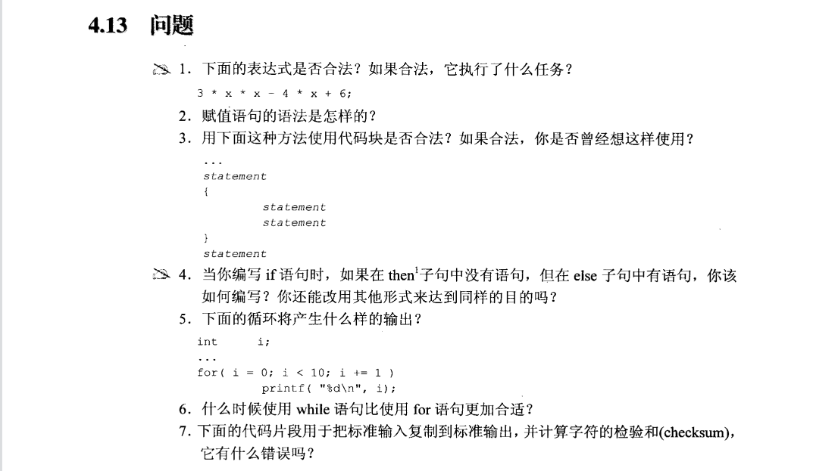
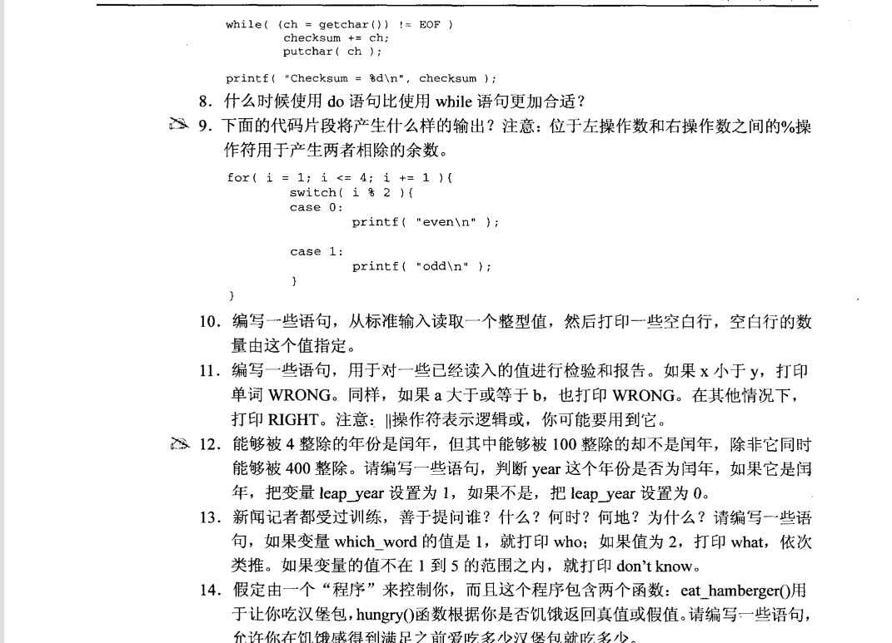
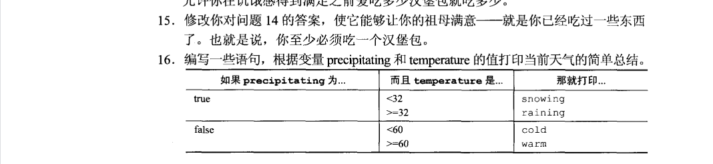

  
**1**.合法，它在执行$3x^2 - 4x + 6$ 则一条算式。  
**2**.***variable = expression***;  
**3**.合法的，可能用过，但不一定想过。  
**4**.若then子句没有语句，可以使用空语句占位。将条件取反，使用一个if语句即可。  
**5**.打印0~9.
**6**.在没有初始化和调整时，**while语句**比较合适。
**7**.对个语句需要用花括号进行成块处理。  
**8**.需要先执行一次在进行判断时，选用do语句较为合适。  
**9**.odd、even、odd、odd、even、odd。   
**10**.考察**while语句的**基本使用，见代码***code10.c***。   
**11**.考察**if—else语句**的基本使用，见代码***code11.c***。  
**12**.判断年份，见代码***code12.c***。  
**13**.考察**switch-case语句**的基本使用，见代码***code13.c***。  
**14**.考察**do-while语句**的基本使用，见代码***code14.c。***  
**15**.同上。
**16**.见代码code16.c。