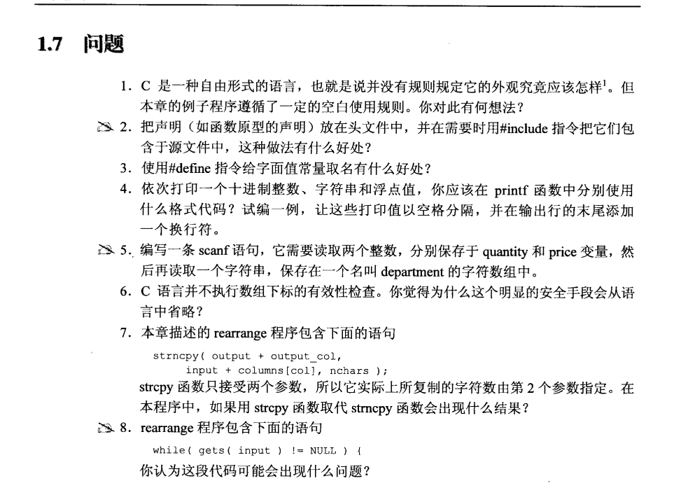

1.规范化书写代码，有利于阅读和修改。  
2.**#include**是预处理指令，把声明放在头文件，方便修改和维护。  
3.**#define**也是预处理指令的一种，见名知意，将变量设置为常量，一般为大写，注意后面没有分号。  
4.printf("%d %s %f\n", a, b, c);  
5.scanf("%d %d %s", &quantity, &price, department);  
6.是为了保持语言的简洁性和的效率，下标检查是程序员自行负责的。  
7.没具体读，母鸡抖！可能是越界吧。
  英文原答案： More characters would be copied than are actually needed; however, the output_col would be updated properly, so the next range of characters would be copied into the output array at the proper place, replacing any extra characters from the preceding operation. The only potential problem is that the unbounded strcpy might copy more characters into the output array than it has room to hold, destroying some other variables.  
8.如果gets()的长度很长，可能会导致数组input越界。