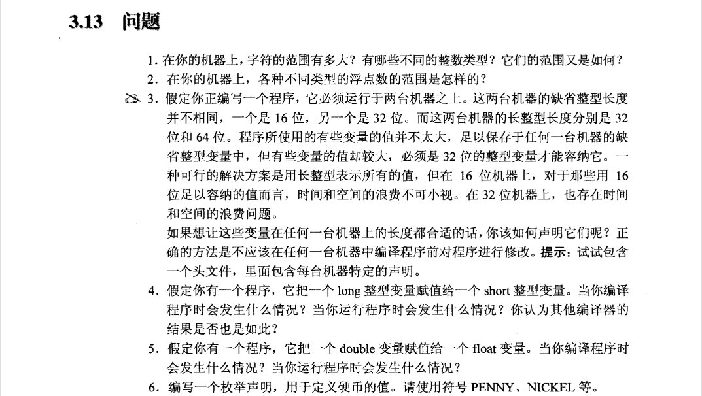
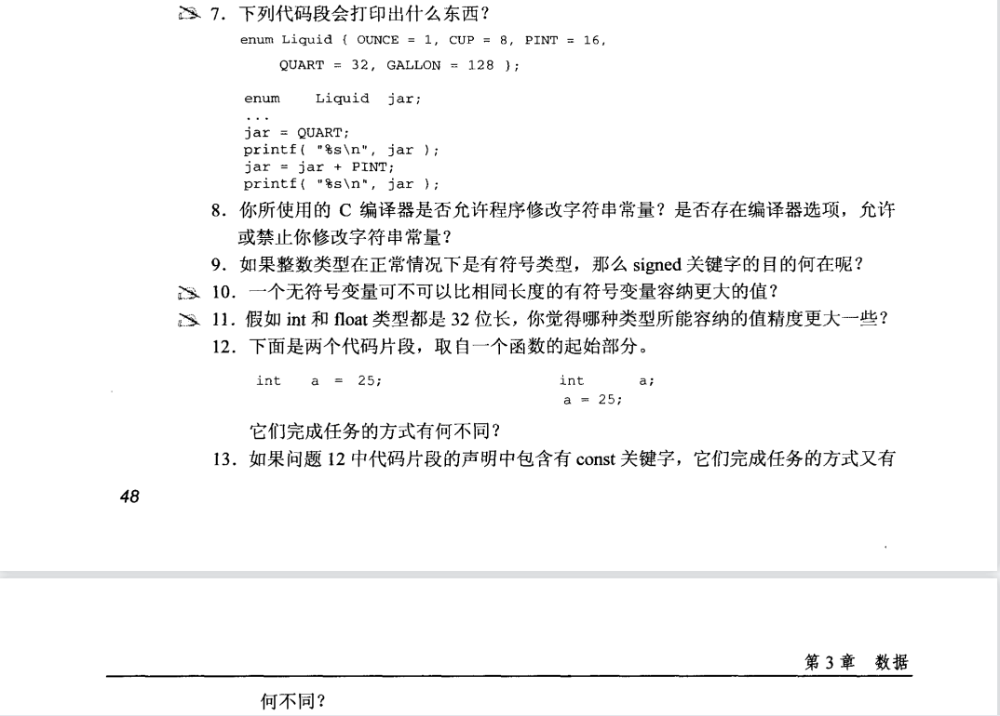
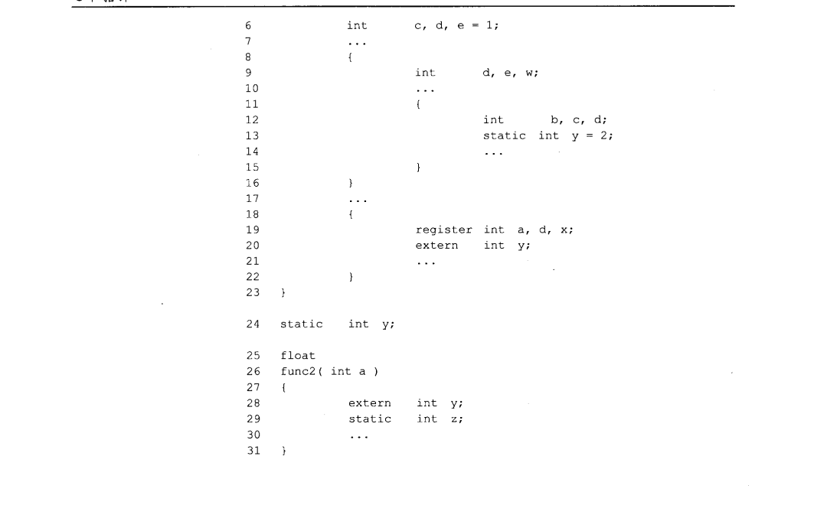

**1**.代码见***code1.c***  
***char***的范围是$(-128,127)$；  
***unsigned char***最大值是$255$。    
***short***的范围是$-(32768, 32767)$；  
***unsigned short***最大值是$65535$。    
***int***的范围是$(-2147483648, 2147483647)$；  
***unsigned int***最大值是$4294967295$。  
***long***的范围是$(-2147483648, 2147483647)$；  
***unsigned long***最大值是$4294967295$。     
**2**.见代码***code2.c***。  
**3**.使用变量类型一定要有一个确定的长度，对于希望成为缺省长度的证书，根据其能够容纳的最大值进行别名，并在每台机器创建一个头文件，用***typedef***进行声明。  
**4**.编译程序时会发生警告。可能会导致数据截断或者溢出，不同编译器的运行结果不一样。  
**5**.编译程序时会发生警告。会导致精度丢失。  
**6**.***enum { PENNY, NICKEL, YUAN, DOLLAR, POUNDS};***  
**7**.因为输出的格式符是%s，且传入的是枚举常量，应该用%d或者%u接收，所以不能确定输出什么。  
**8**.不允许。
**9**.显示地标记整数类型为有符号类型，并增加代码的可读性和明确性，从而提高代码的可以执行的和理解性。
**10**.否，一个有符号值和无符号值仅有的区别是在于他的一半值是如何解释的。  
**11**.***float***类型所能容纳的值精度比***int***类型要小。  
**12**.没有不同。
**13**.左边可以，右边不行。不能给常量赋值。
**14**.错，只能在该声明后到该代码块结束部分访问。
**15**.错，局部变量永远不能被直接访问。
**16**.不会发生变化，***static***关键字并不能修改变量的作用域。
**17**.这是全局变量，不需要添加额外的声明。
**18**.不会，依然是全局变量。同一文件下都可以访问。
**19**.因为是不同文件访问变量，所以要添加额外的声明。将int x;修改为extern int x;
**20**.若用***static***去修饰声明，则任何外部文件都不能访问本文件的变量。
**21**.可能相同。  
**22**.若出现在代码内部，该变量的值在每次执行代码块时都会被重新初始化；若在代码块外，则可能只用声明一次，具体看情况。  
**23**.见代码***code20.c。***  
**24**.不想写。
