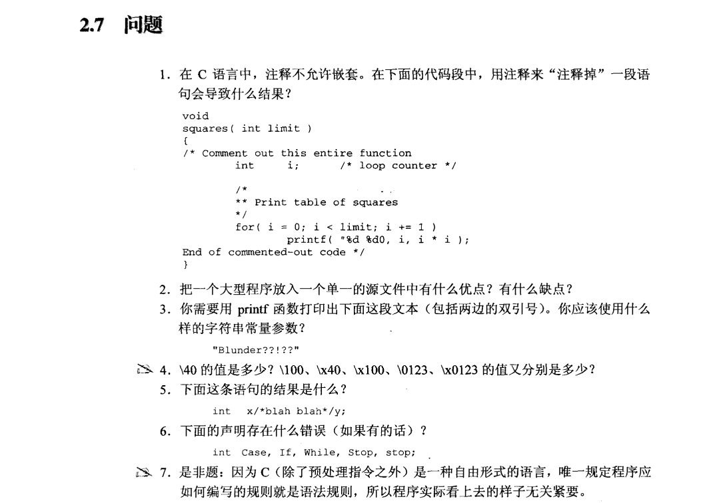
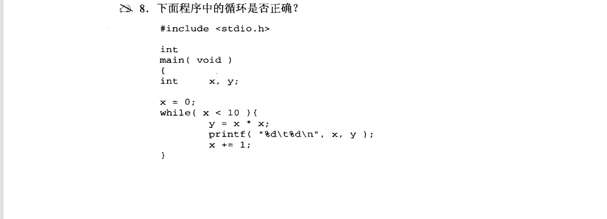
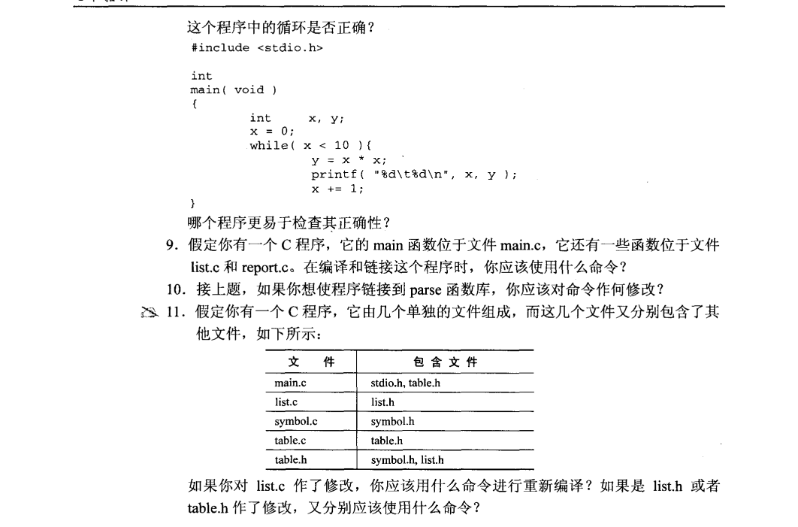

1.用注释来“注释掉”一段语句即嵌套注释会导致程序报错。

2.优点：减少了文件的数量和复杂性、简化了编译和构建的过程、函数与变量可以共享。
  缺点：可维护性降低、可扩展性降低、增加编译时间、容易命名冲突。

3.printf("\"Blunden\?\?!??\"");

4.\40 = 空格字符 
  \100 = @
  \x40 = @

5.int x, y;

6.关键字不能用于标识符。

7.否。

8.不正确，while循环的花括号不相匹配；后者更易于检查正确性。

9.gcc main.c list.c report.c

10.gcc main.c list.c report.c -lparse

11.见make工具和makefile的基本使用。