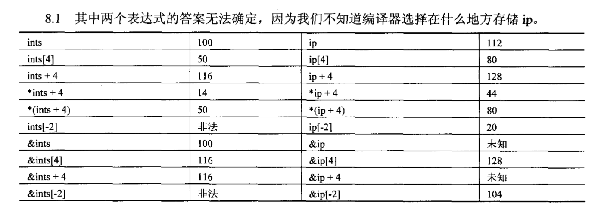
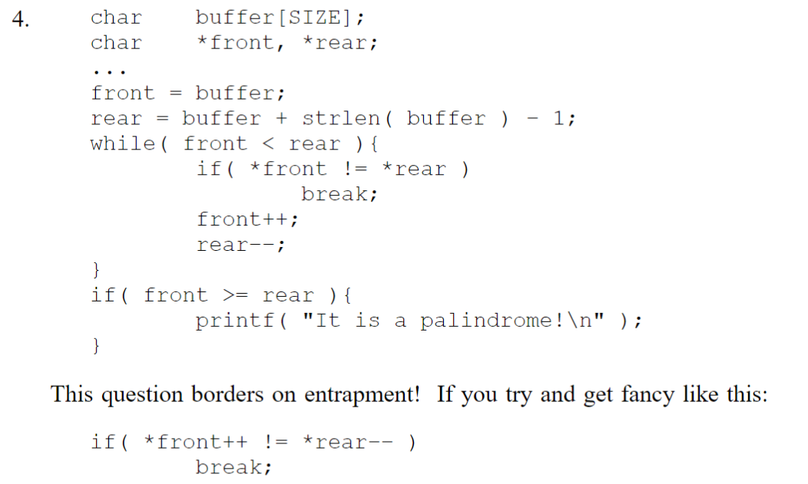
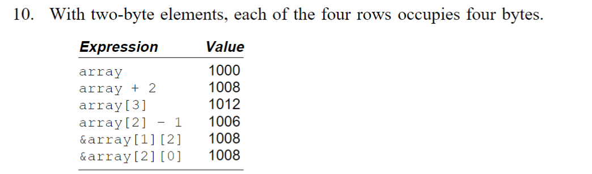
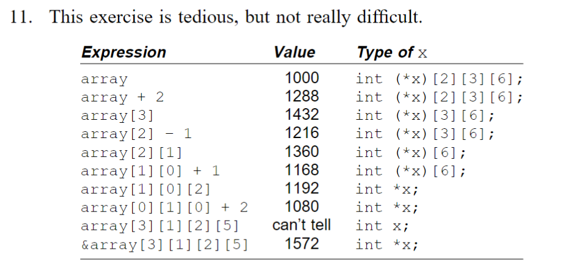
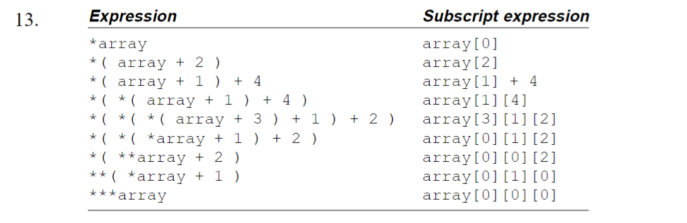

# 8.7 问题
**1**.这东西还是细心点吧，注意运算符的优先级

**2**.不是等价的，第二个等价于**array[j] + i**  
**3**.不能成功的，这样就是越界访问了  
**4**.直接贴图大法，回文字符串的检测还是蛮重要的  

**5**.个人认为应该大部分是下标，因为易于理解  
**6**.汇编还不会哈  
**7**.同上  
**8**.报错？程序终止？未知！  
**9**.int coinvalues[] = {1, 5, 10, 20, 100};  
**10**.贴图，注意数组的存储是连续的 
 
**11**.算的很是艰辛  

**12**.主序存储是连续存储吗？！  
**13**.贴图  
**14**.用一个整型指针接收  
**15**.第二个，因为*which*可能会越界  
**16**.第一个是形参，他的内容是可变的，第二个是一个常量不可变  
**17**.第一个**const**是保护**a**的值不会被修改，第二个**const**是保护整型指针**b**保持不变  
**18**.void function(int (*array)[2][5])