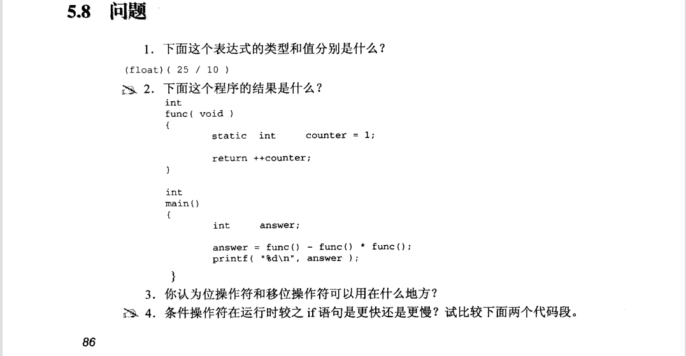
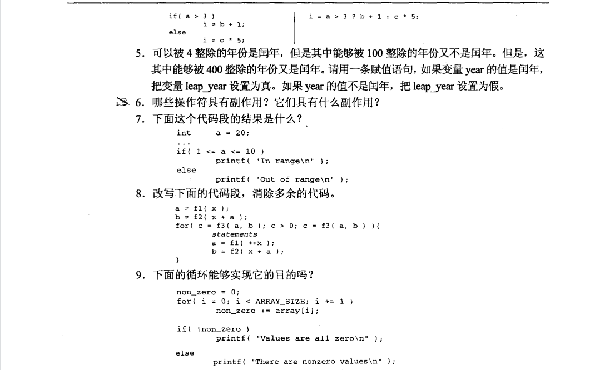
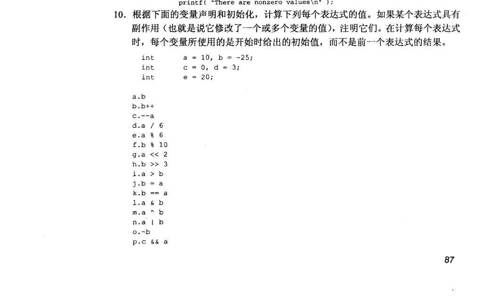
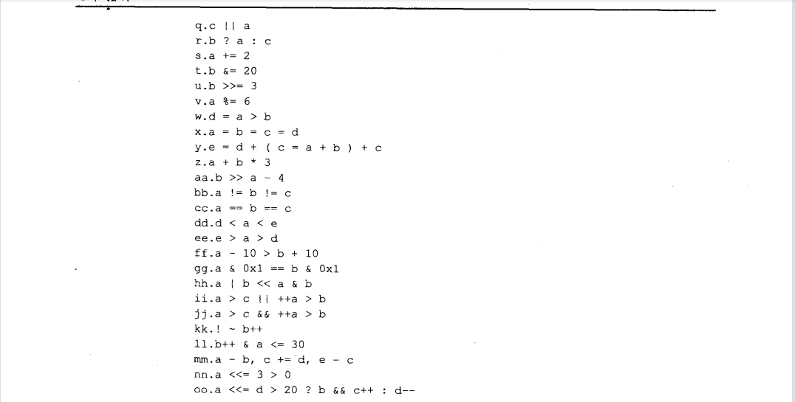
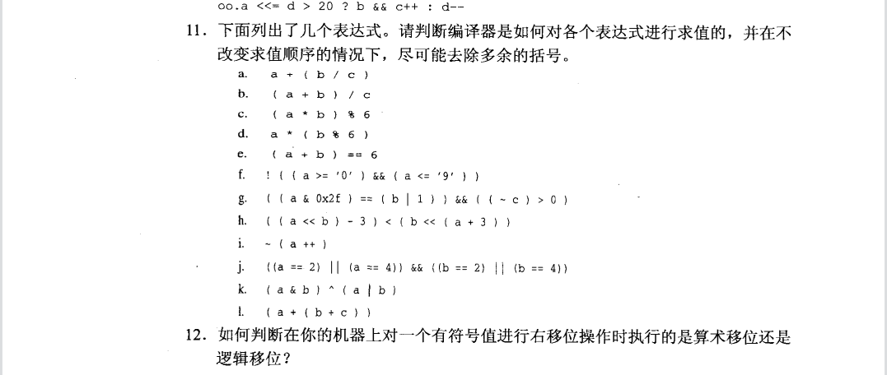
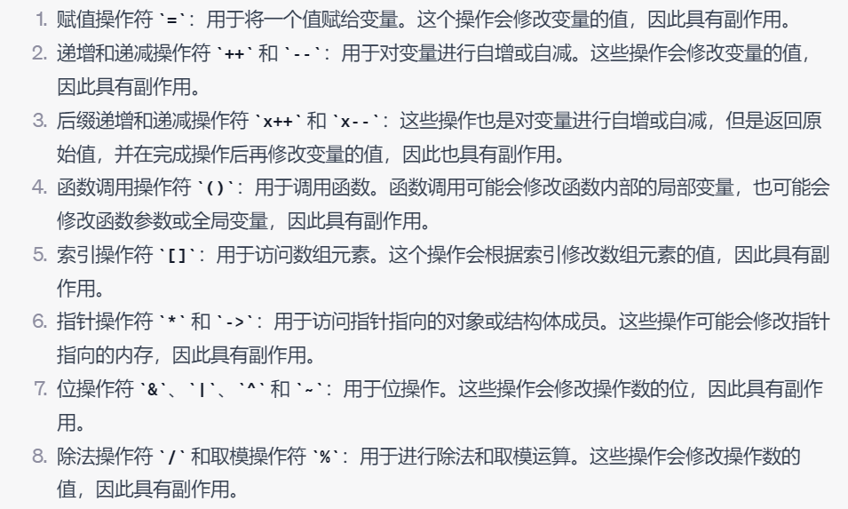
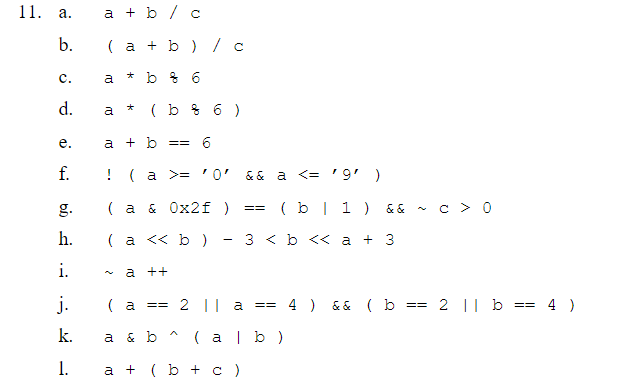

1.表达式的类型是float，值是2.0。

2.没有固定答案，看编译器吧，可能是-10、-2或者-5。

3.不太清楚！二进制数？？底层控制设备？？让我在成长成长！！！

4.差不多的吧。

5.见code5.c

6.偷个懒，GPT一下，没想到这么多。
    
    
7.In range。首先1 <= a 成立，可以当作1，再者1 <= 20,条件成立进入if。

8.hahaha!!!!
    [Alt text](image-6.png)

9.不能，for循环后不清楚non_zero的值。

10.再偷个懒哈哈哈！
    [Alt text](image-7.png)

11.参考答案

12.声明一个负数，进行右移操作，对其进行原反补的计算，再运行输出这个结果就知道了。
