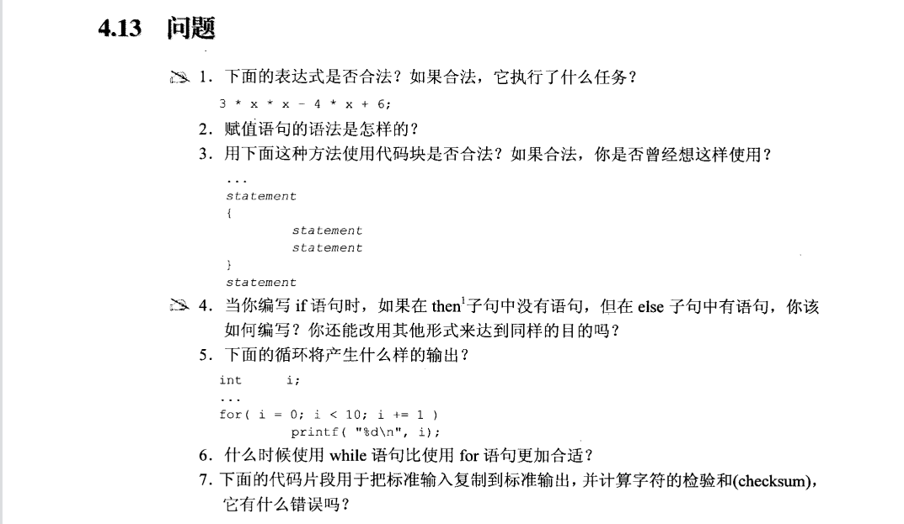
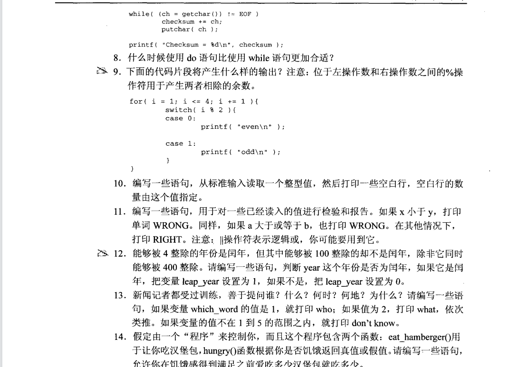

1.合法，它在执行3x^2 - 4x + 6 则一条算式。

2.variable = expression;

3.合法的，可能用过，但不一定想过。

4.若then子句没有语句，可以使用空语句占位。将条件取反，使用一个if语句即可。

5.打印0~9.

6.在没有初始化和调整时，while语句比较合适。

7.对个语句需要用花括号进行成块处理。

8.需要先执行一次在进行判断时，选用do语句较为合适。

9.odd、even、odd、odd、even、odd。

10.考察while语句的基本使用，见代码code10.c。
    
11.考察if—else语句的基本使用，见代码code11.c。

12.判断年份，见代码code12.c。

13.考察switch-case语句的基本使用，见代码code13.c。

14.考察do-while语句的基本使用，见代码code14.c。

15.同上。

16.见代码code16.c。