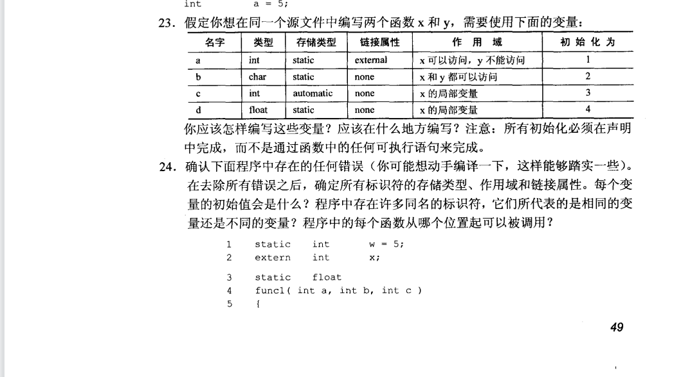

1.代码见code1.c
    有符号的字符的范围是-128~127；无符号的字符最大值是255。
    有短整型、整型和长整型。
    有符号的短整型的范围是-32768 ~ 32767；无符号的短整型最大值是65535。
    有符号的整型的范围是-2147483648 ~ 2147483647；无符号的整型最大值是-1。
    有符号的长整型的范围是-2147483648 ~ 2147483647；无符号的长整型最大值是-1。

2.见代码code2.c
    